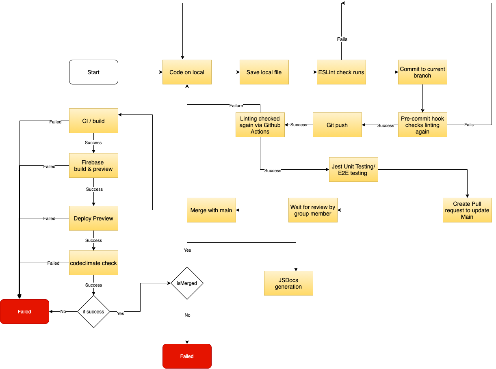

# Updated CI Pipeline Status Phase 1


## Linting/Code Style Enforcement:
**Functionality:** 
- At this moment, we are doing linting via ESLint. This is not automatic, but should be run by the programmer by running the command: 
  
  ``` npx eslint yourfile.js ```

- This will allow the programmer to make sure that they are following the coding style before they push to the repository.
---

## Code Quality Checks:
**Functionality:**
- For code quality checks, we are using Codeclimate. Codeclimate is set up so that whenever there is a pull request into the main branch, it will run the code to check for technical debt, like a file with too many lines or functions with too many arguments, and to check for similar code in different places.
- Automatically run during pull requests to main.
- Codeclimate checks for custom settings that was decided on as a team that we felt would best enforce good quality
---
## Code Quality via Human Review:
**Functionality**
- For code quality checks via Human Review, we have a rule where 2 other people need to approve the pull request before we can merge the branch. Since the repository is free and private, we cannot make it so that we automatically need 2 reviewers before we can merge. This makes it so that we have to manually select someone to review it, wait for them to review it, and then select another person, since only one person can be selected to review at one time.
- To make this process more efficient, we communicate via Slack so that the pull request can be reviewed more quickly
---
## Unit Testing via Automation:
**Functionality**
- For unit testing, we have setup jest to run on pushes. At this time, we only have minimal unit testing. 
- For e2e testing we are using jest-puppeteer which is also checked when code is pushed. We have multiple tests for each file covering the major interactions of the bullet journal
---
## Documentation Generation:
**Functionality**
- For documentation generation, we are using JSDocs. At this time, we have it so JSDocs will run on pushes to the main branch. 
- When a push to the main branch occurs, JSDocs updates the documentation for our current files and saves it in a folder called "out" in the root directory
---
## Deployment
**Functionality**
- Right now, we are using FireBase to deploy our application and we have it so on pull requests, Github Actions will build a preview and deploy it to a test site to check how it works. 
- Automatically run on all Pull Requests made.


---

