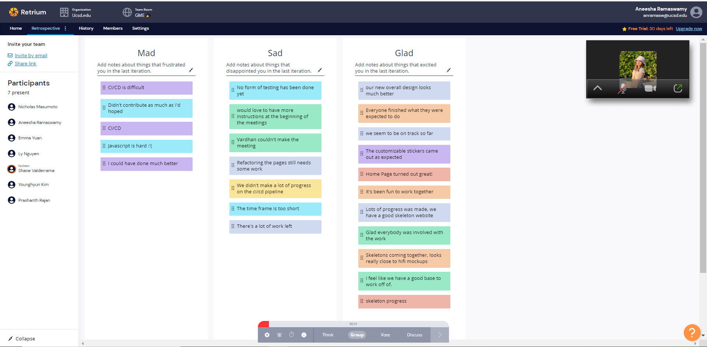
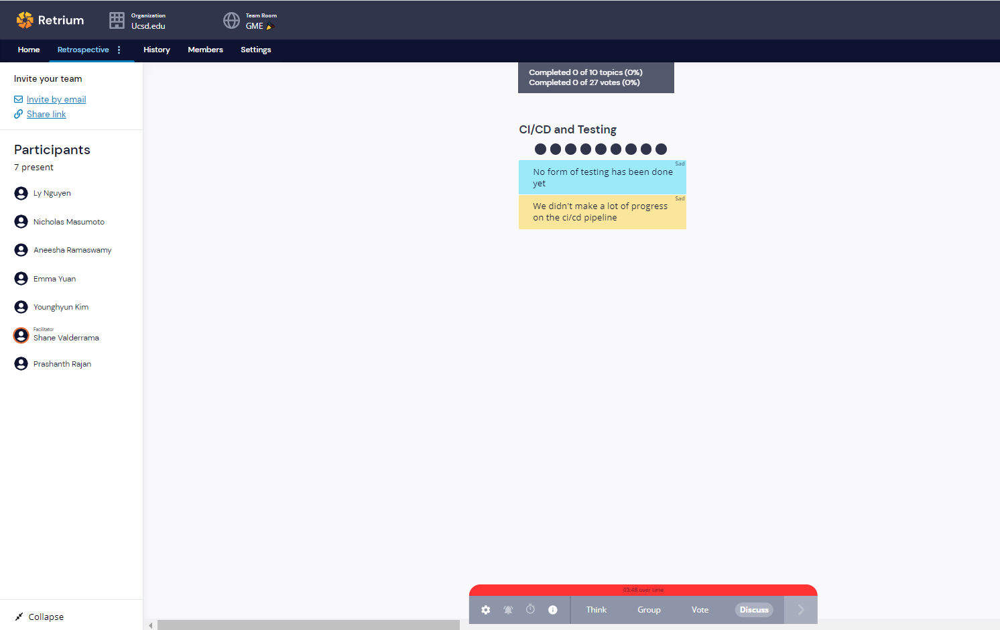

# Good Mighty Engineers (24) - Retrospective Meeting 5/16/2021

### Meeting held over Zoom at 12:30PM

**Members Present**: Aneesha, Nicholas, Prashanth, Younghyun, Ly, Emma, Shane

**Members Absent**: Vardhan

**Agenda**:  
- Run retrospective meeting

**Notes**:  
- Ran team radar activity
    - Ranking of around 3-5 for each category, with fairly small spreads for each category
    - Everyone seems to be on about the same page
- Ran Glad/Mad/Sad retrospective

*CI/CD Pipeline*:
- Have not made as much progress as we would have liked on it, need to add actions for JSDocs, Jest, and ESLint
- **Action Item**: Try to finish most of it today, and update at the general meeting tomorrow
- **Action Item**: Ask Deepak for more details about what the testing will look like

*JS is hard*:
- Will continue to keep a open line of communication within the team to support each other
- Ask mentors for resources if stuck

*Overwhelming amount of stuff left to do*:
- Based on other team projects from Deepak's teams, we're going at a similar pace, so likely at a good spot
- **Action Item**: Group similar tasks (like task editing) so that there are fewer redundancies and project development can be more efficient

*Other*:
- **Action Item**: Ask Deepak about storing information in Firebase vs other options
- Generally, lots of good comments
    - Postive feedback on the team dynamic, the work we have accomplished so far, and communication

### Meeting finished at 1:00PM