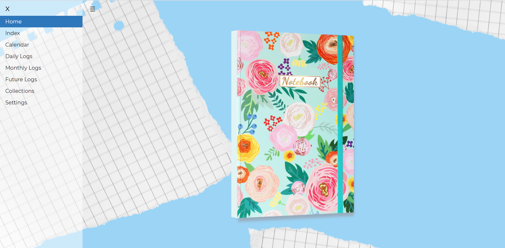
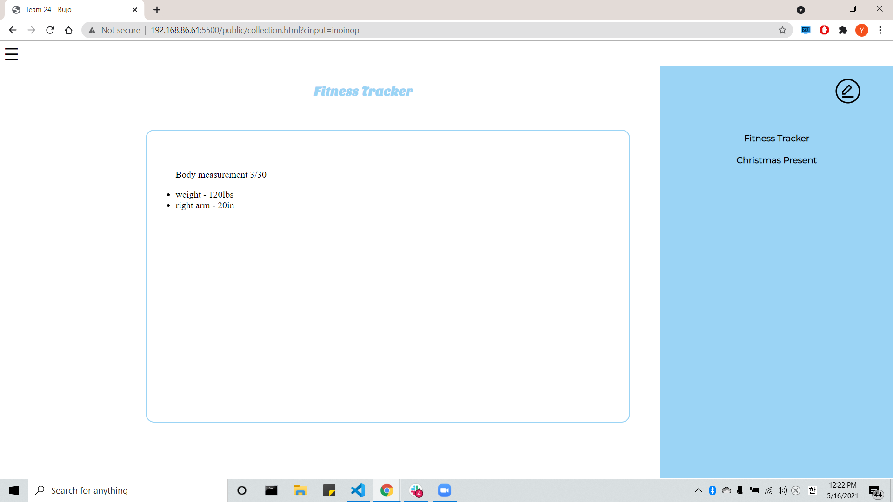
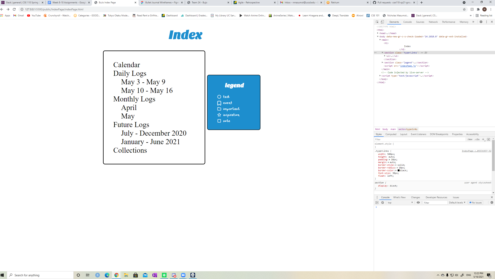

# Good Mighty Engineers (24) - Sprint Review Meeting 5/16/2021

### Meeting held over Zoom at 12:00PM

**Members Present**: Aneesha, Nicholas, Prashanth, Younghyun, Ly, Emma, Shane

**Members Absent**: Vardhan

**Agenda**:
- Conduct sprint review meeting

**Notes**:  
*Home Page*:  
- working animation looks good

*Future Log*:  
- Skeleton matches Figma really well  

*Custom Collection*:
- Skeleton with Figma design looks great  

*Daily Log*:
- Matches design closely and works with the flex layout

*Index*:
- Nice layout with working test links

*Sticker Customization*:
- The sticker customization feature has a lot of great functionality, including uploading custom stickers and dragging and dropping them anywhere on a page

*Overall*:
- We've made a lot of progress this week! The website is deployed through Firebase and we have a skeleton of the different pages, along with some of the basic functionality.

**Decisions**:  
N/A

**Action Items**:  
N/A

### Meeting finished at 12:30PM