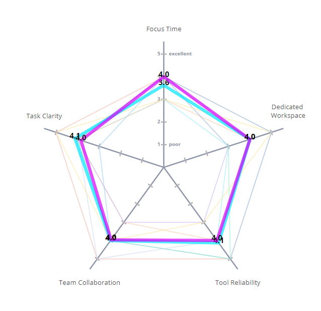
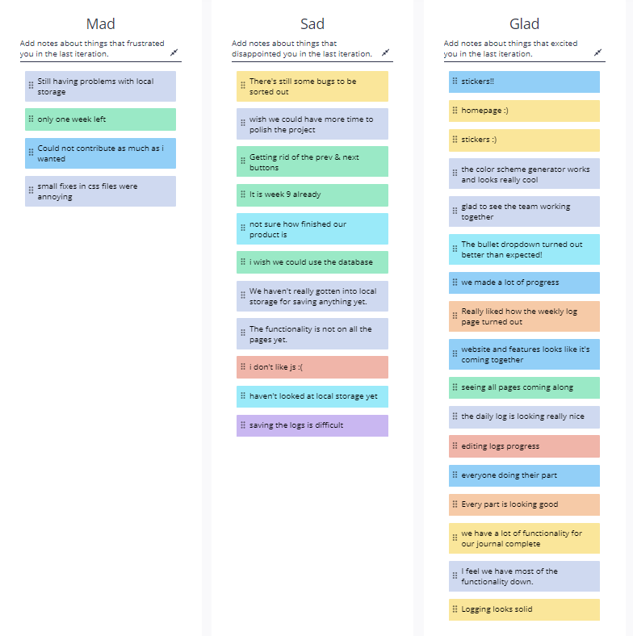
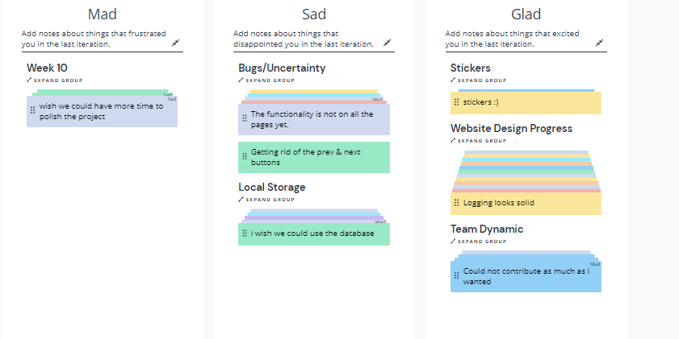

# Good Mighty Engineers (24) - Retrospective Meeting 5/30/2021

### Meeting held over Zoom at 11:30PM

**Members Present**: Aneesha, Nicholas, Prashanth, Younghyun, Ly, Emma, Shane, Vardhan

**Members Absent**: N/A

**Agenda**:  
- Run retrospective meeting

**Notes**:  
- Ran team radar activity
    - Ranking of around 3-5 for each category, with fairly small spreads for each category
    - Everyone seems to be on about the same page
- Ran Glad/Mad/Sad retrospective

*#1 Local Storage*:
- It is hard to store everything as a string, and storing bullets and stickers is hard  
- Tricky to store entries, since it would be easier to store them as objects  
- **Action Item**: Do more research on local storage and as Deepak for advice

*#2 Bugs and Uncertainty*:
- Bullet alignment on weekly log
- Code coverage on puppeteer
- Local storage
- Generating dates
- Overall, good progress though, and week 10 is a good time to be fixing these bugs

*#3 Week 10*:
- :'(
- We likely won't have enough time to really polish the website, but the core functionality should be there

*Other*:
- Generally, lots of good comments
    - Postive feedback on the team dynamic, the work we have accomplished so far, and communication

### Meeting finished at 12:00PM