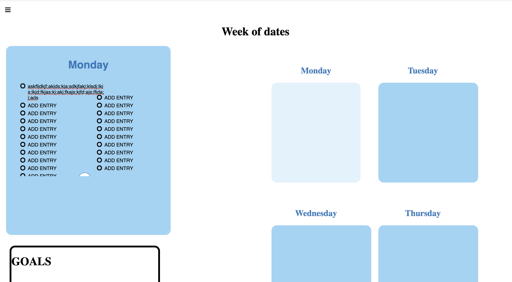
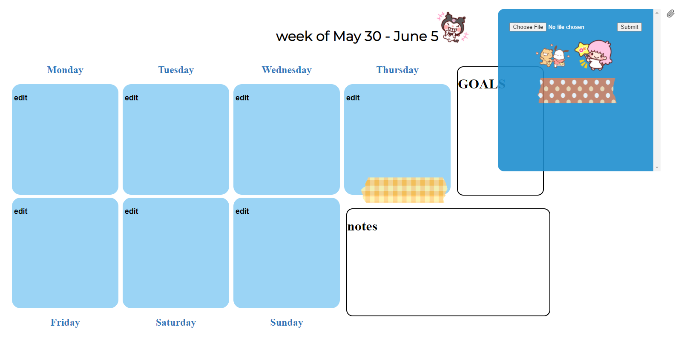
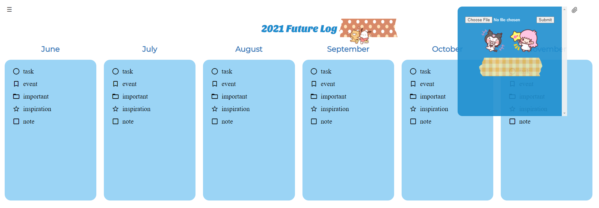
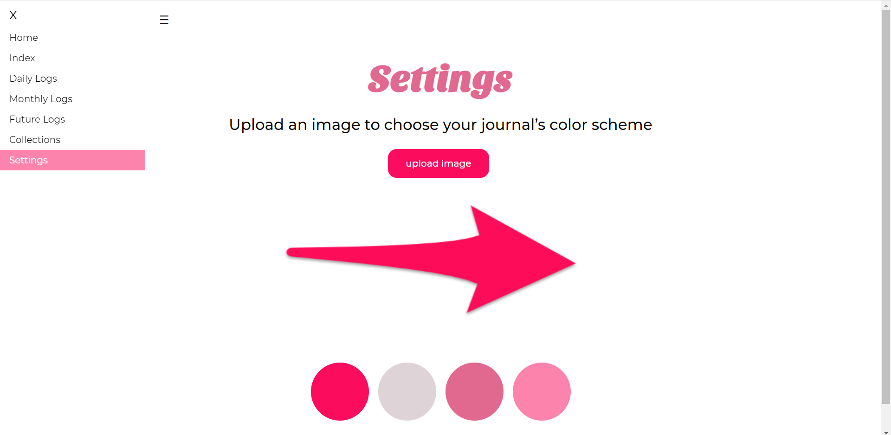
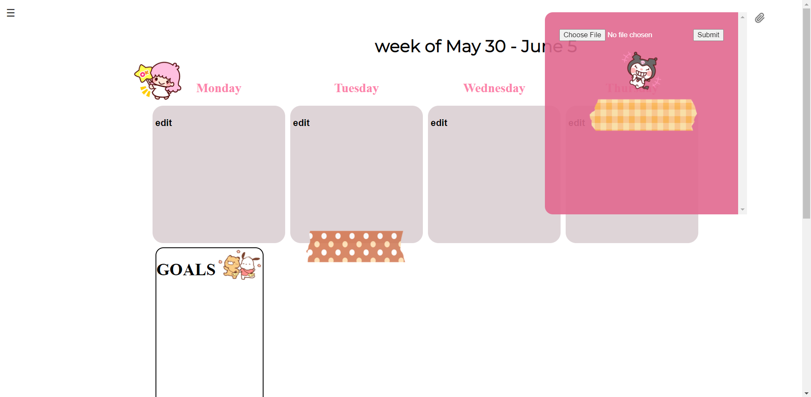
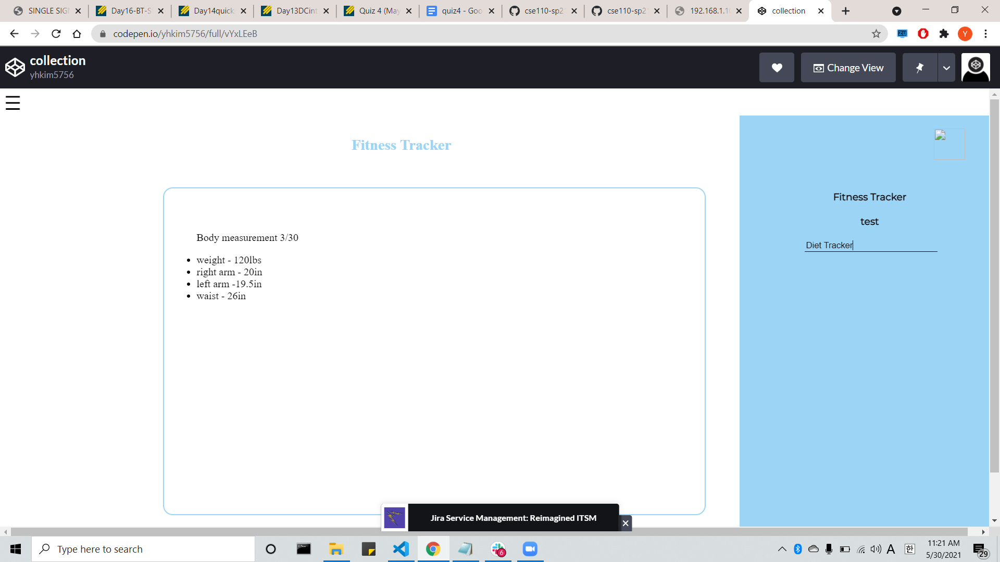
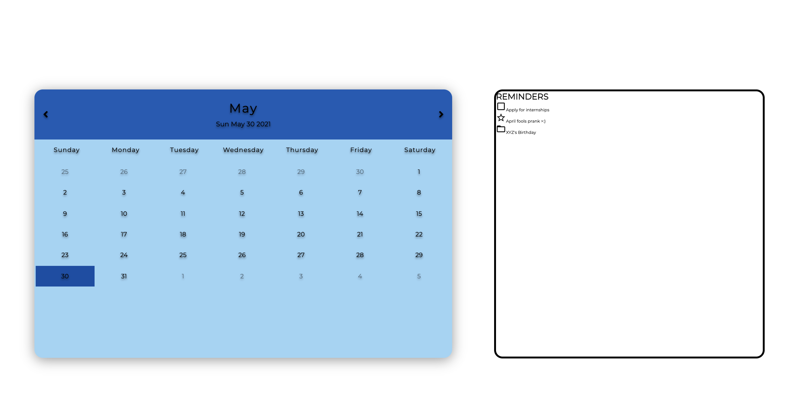
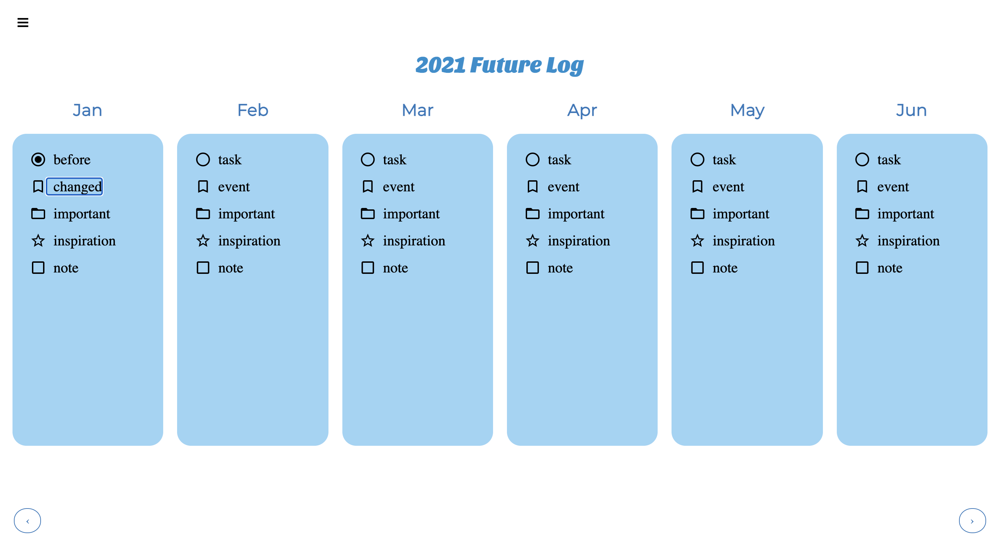

# Good Mighty Engineers (24) - Sprint 2 Review Meeting 5/30/2021

### Meeting held over Zoom at 11:00AM

**Members Present**: Aneesha, Shane, Prashanth, Ly, Vardhan, Nicholas, Emma, Younghyun

**Members Absent**: N/A

**Agenda**:
- Run sprint review

**Notes**:  
*Daily Logs*
- Lots of progress! 
- Functionality added:  
  - In-place editing of entries
  - Ability to add entries and scroll through them
  - Can change the bullet type on click
  - Can mark entry as completed on click
  - Can delete entry on click

*Stickers*  
- Added to each log/collection page
- Functionality added:
  - Can upload custom stickers
  - Can place stickers anywhere on the page

*Color Scheme Generator*
- Can upload an image and apply the generated color palette to the journal!

*Collection Page*
- Bugs with page fixed
- Functionality added: 
  - Can add new collection titles
  - Can switch between collection titles

*Calendar*
- Functionality added:
  - Autogenerating dates on the calendar for the months
  - Reminders bar for the logging aspect

*Future Log*
- Functionality added:
  - Current months autogenerated
  - In-place editing and checking items  

**Decisions**:  
N/A

**Action Items**:  
N/A

### Meeting finished at 11:30AM