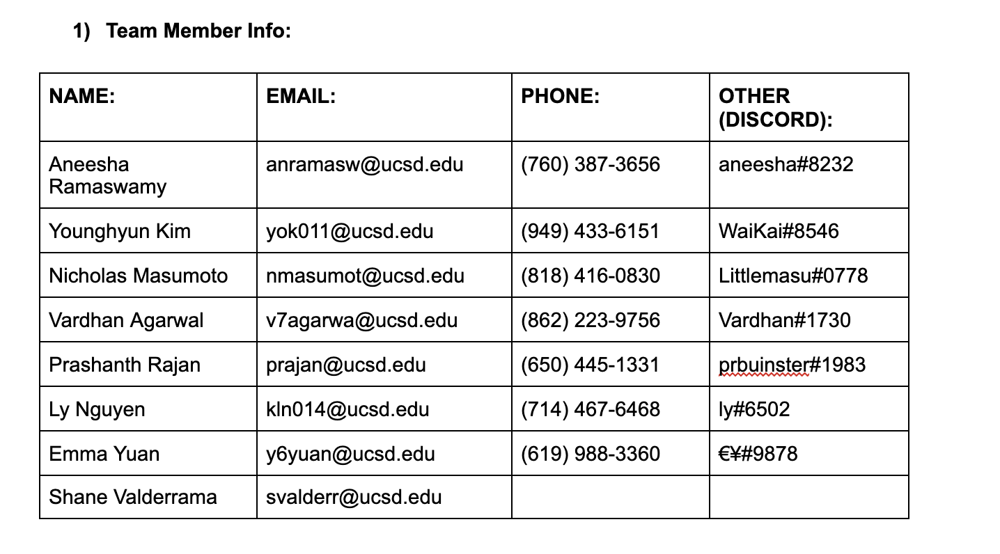

# Team Working Agreement
### Spring 2021
### Created 4/10/2021

### Primary Means of Communication and Expectations
All members will be expected to check the team Slack at least once every 24 hours for updates and respond as soon as possible. The members should also give a weekly update over Slack to communicate the progress on their tasks.
### Scheduling Meetings
All members are expected to fill out a when2meet promptly when needed to schedule meetings. Members are also expected to attend meetings on time or let the team know if they cannot make it.
### General Responsibilities for all Team Members
Members should complete tasks on time or ask for help/extension in the team Slack if any issues come up. Members should also communicate with each other on current tasks and updates as they come up.
### Specific Team Member Responsibilities/Deadlines
*Developers* - When a team member works on a feature, it should be created on a new branch and approved by two team members before merging into master.

*Leaders* - Should make sure there is clear communication between the team as well as between the team and faculty. Leaders should also make sure that there are clear task assignments and keep up to date with progress.

*Designers* - Should communicate with developers in the process of designing.
### Rules
Members are expected to follow the above rules and if they are consistently not being followed, they and one of the leaders will have a conversation to figure out specific steps to resolve any issues. If the issue continues, further steps can be discussed as a group.
### Member Roles
* Aneesha Ramaswamy - Leader
* Shane Valderrama - Leader
* Younghyun Kim - Designer
* Vardhan Agarwal - Developer
* Prashanth Rajan - Developer
* Nicholas Masumoto - Developer
* Emma Yuan - Developer
* Ly Nguyen - Developer
### Team Signatures

