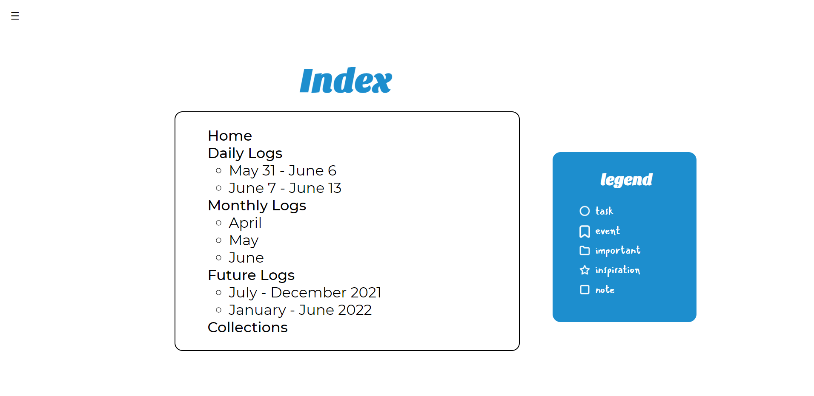
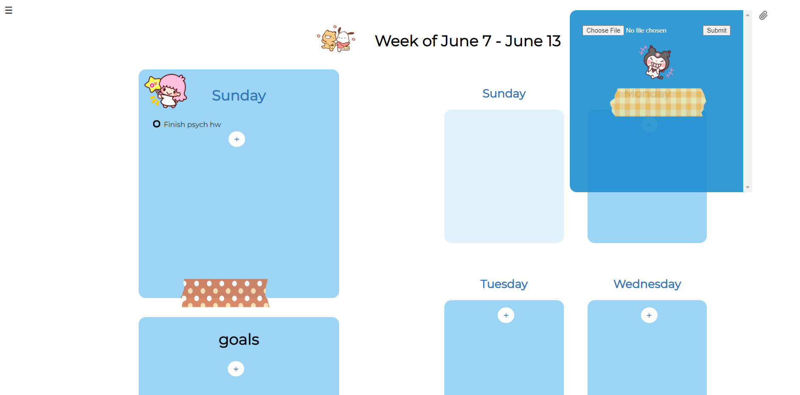
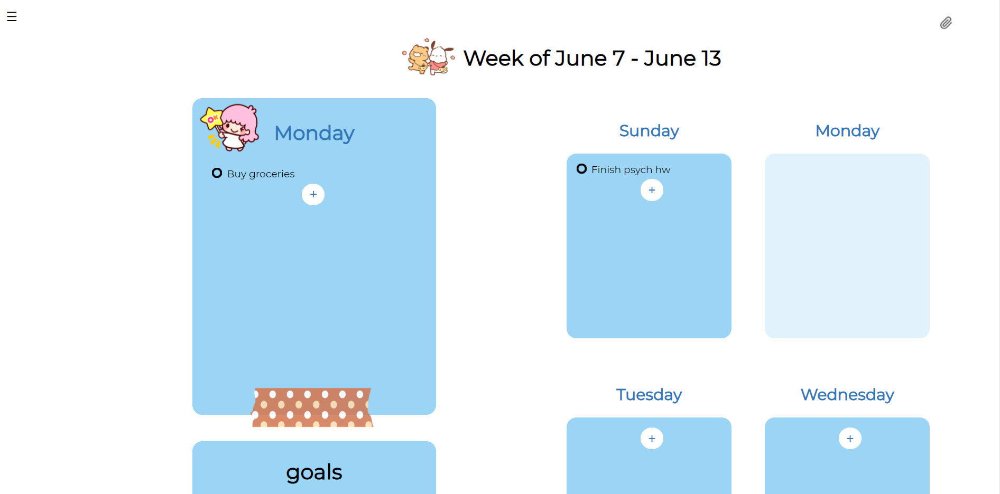
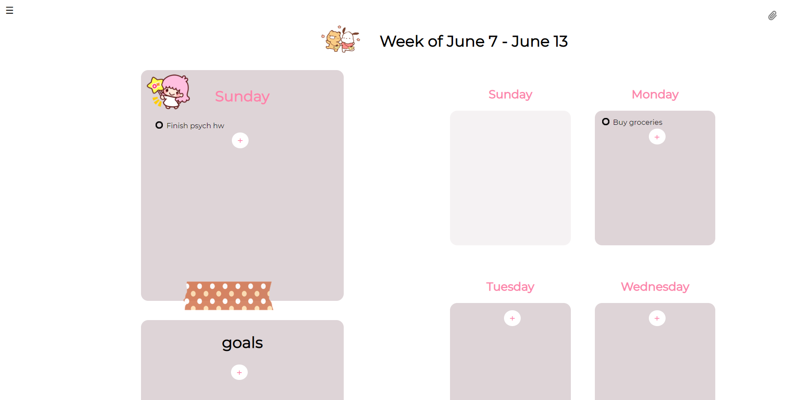
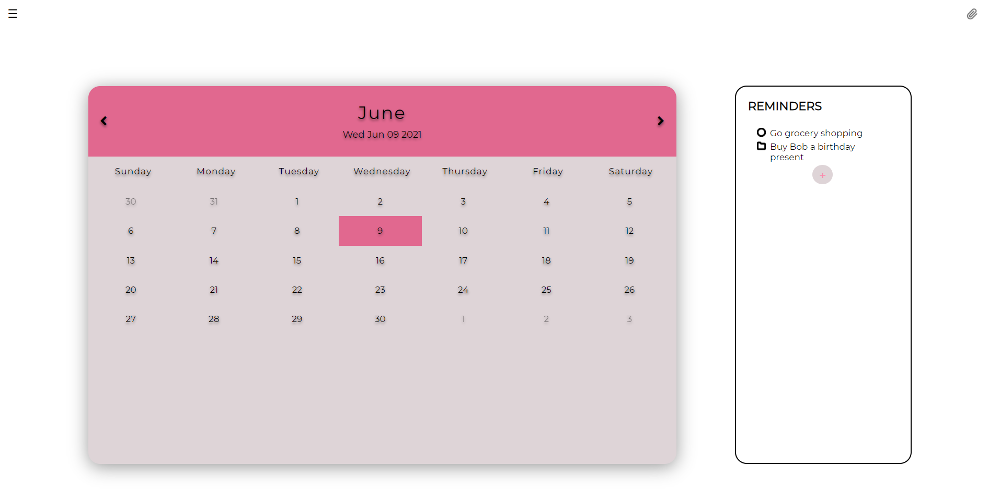

# BuJo

## Home Page

  

The landing page of our BuJo application has a journal animation that can be clicked on to directly navigate to the index page, somewhat like opening a book. 

There is also a navigation bar on the top left (of all pages) that lets you directly navigate to any of the pages of the application.

## Index

The index page features a list of the current log and collections pages along with a legend that specifies what each of the bullet icons mean. The daily log section will contain links to the most current two weeks of logging (this week and last week), the monthly log to the past three months, and the future log to the current six months and the next six months. There is a single link to the collections page, because the page has its own menu of collections that can be navigated between. The dates in the index are auto-generated so are always up to date, and clicking on any of the links will take you to the corresponding log or collection page.

## Daily Log

The daily log for each week has seven sections on the right that can be used to log any items for the corresponding days. After clicking the "+" button, an entry is added as shown, with options to change the bullet types and replace the text. Once the user is finished editing, the save icon should be clicked, and the entry will be saved.

Each page can also be customized with stickers! If the user opens the stickers popup in the top right, they will be able to add existing stickers by dragging them anywhere onto the page. Additionally, the user can upload any custom stickers they want to add from their computer. 

In order to emphasize the current day, any day on the right section can be clicked and it will appear in the left side daily view.

## Monthly Log

Monthly logs allow the user to keep track of events ocurring on a monthly basis, as well as use the calendar to easily navigate to past daily logs

## Future Log

Future logs allow users to keep track of events coming up in the next 6 months.

## Collections

Collections allow user to keep track of custom items. After clicking the pencil tool on the right, they can add their own collection and keep track of anything they would like to. For example, they might want to add a collection for fitness or sleep tracking.

## Settings

From the settings, the user can see their current color theme for the application.

The user can upload an image to change the color palette of the entire application.