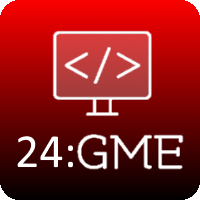
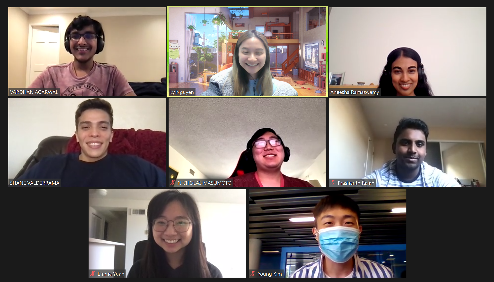

#  **G**ood **M**ighty **E**ngineers **(GME)** 

We are the Good Mighty Engineers (GME)

## Goals
1. Take this project to the Moon!

## Values
1. Strong communication
2. Being open about issues
3. Process over product

## Who we are

* **Shane Valderrama** (Leader)
  * 2nd Year
  * Computer Engineering
  * Warren College
  * Hobbies: Drawing, Basketball, Reading, Hiking, Gym
  * [Personal Page](https://github.com/ShaneVal)
* **Aneesha Ramaswamy** (Leader)
  * 2nd Year
  * Computer Science
  * Muir College
  * Hobbies: painting, piano, hiking, cats
  * [Personal Page](https://www.linkedin.com/in/aneesha-ramaswamy/)
* **Younghyun Kim** (Designer)
  * 3rd Year
  * Computer Science
  * Revelle
* **Emma Yuan** (Developer)
  * 2nd Year
  * Math-CS
  * Warren College
  * [Personal Page](https://www.linkedin.com/in/emma-yuan/)
* **Ly Nguyen** (Developer)
  * 2nd Year
  * Computer Science
  * Warren College
  * Fun Fact: I have drank 100+ bubble teas in 2020
  * Hobbies: hiking, video games, shopping, exploring new food places
  * [Personal Page](https://www.linkedin.com/in/lynguyxn/)
* **Nicholas Masumoto** (Developer)
  * 2nd Year
  * Computer Science
  * Marshall College
  * [Personal Page](https://github.com/nmasumot)
* **Prashanth Rajan** (Developer)
  * 2nd Year
  * Computer Science
  * Marshall College
  * Hobbies: Tennis, biking, TV shows, dogs
  * [Personal Page](http://linkedin.com/in/rajanprashanth/)
* **Vardhan Agarwal** (Developer)
  * 2nd Year
  * Computer Science
  * Sixth College
  * Hobbies: hiking, philately, table tennis, cricket, lawn tennis
  * [Personal Page](https://www.linkedin.com/in/vardhanagarwal/)
